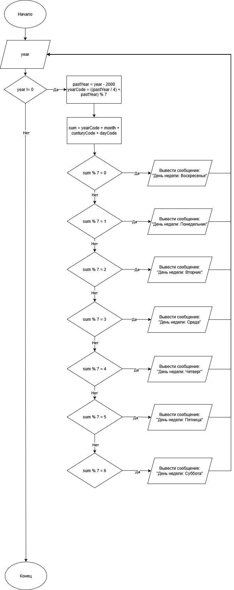

# Домашнее задание к работе 7

## Условие задачи
Определить на какой день недели приходится 1 сентября произвольно заданного года XXI века.
## 1. Алгоритм и блок-схема

### Алгоритм
1. **Начало**
2. Объявить переменную для сохранения введенного пользователем года и использования её в качестве переммной для отслвеживания желания пользователя выйти:
   - `year` = 1 - переменная для сохранения года, введенного пользователем. Изначально равна единице, потому что переменная должна быть инициализварона для использования её в цикле, которые содержит функцию сбора данных пользователя
3. Внутри цикла while объявим переменные для расчетов:
   - `pastYear` - последние две цифры года
	- `yearCode` = ((`pastYear` / `4`) + `pastYear`) % `7` - рассчет кода года
	- `monthCode` = 5 - фиксированное значени кода сентября
	- `centuryCode` = 6 - фиксированное значени кода века
	- `dayCode` = 1 - фиксированное значение числа месяца
	- `sum` = `yearCode` + `monthCode` + `centuryCode` + `dayCode` - итоговая переменная для подсчета суммы ранне определнный значений и использования её в дальнешйем для определния дня недели

4. Используем управляющую конструкцию switch для многоальтернативного выбора, которая в будет выводить "Воскресенье" в случае, если результат деления с остатком равен 0, если 1, то "Понедельник" и т.д.
5. В случае если пользователь введет 0 программа закроется, иначе она продолжит свою работу
9. **Конец**

### Блок-схема
 

## 2. Реализация программы

```C
#include <stdio.h>
#include <locale.h>

int main()
{
    setlocale(LC_ALL, "RUS");

    int year = 1;

    puts("Чтобы выйти из программы введите \"0\"");
    while (year != 0)
    {
        printf("Введите год XXI века: ");
        scanf("%d", &year);

        int pastYear = year - 2000;
        int yearCode = ((pastYear / 4) + pastYear) % 7;
        int monthCode = 5;
        int centuryCode = 6;
        int dayCode = 1;
        int sum = yearCode + monthCode + centuryCode + dayCode;

        switch (sum % 7)
        {
            case 0:
                puts("Воскресенье");
                break;
            case 1:
                puts("Понедельник");
                break;
            case 2:
                puts("Вторник");
                break;
            case 3:
                puts("Среда");
                break;
            case 4:
                puts("Четверг");
                break;
            case 5:
                puts("Пятница");
                break;
            case 6:
                puts("Суббота");
                break;
        }
    }
    
    return 0;
}
```

## 3. Результаты работы программы

```
Чтобы выйти из программы введите "0"
Введите год XXI века: 2025
Понедельник
Введите год XXI века: 0
Четверг

C:\Programs\VS\VSProjects\Homework\HM_7\x64\Debug\HM_7.exe (процесс 1304) завершил работу с кодом 0 (0x0).
Нажмите любую клавишу, чтобы закрыть это окно:
```

## 4. Информация о разработчике

Григорян Эмиль, бТИИ-251
